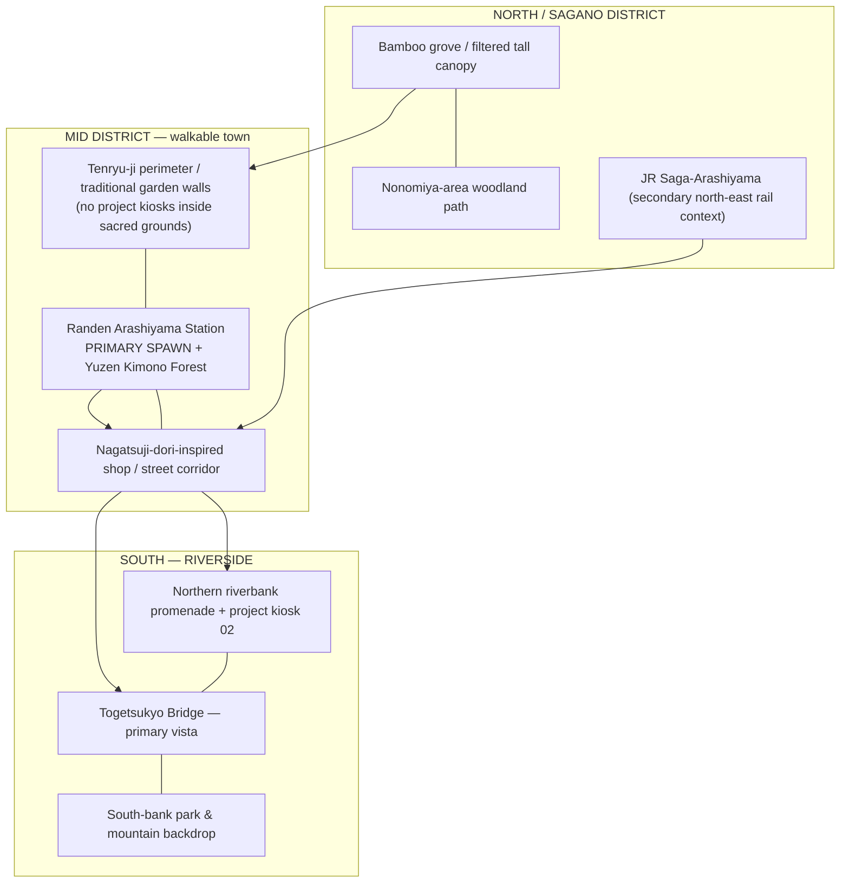

# [X1] Arashiyama Vertical Slice — Geographic Blockout & UI/Art Handoff (v0.1)
**Status:** Designer proposal; approval pending Agent Z.  
**Owners:** X1 creative/art/UI specification; XO runtime scene/code; T1 testing.  
**Parent:** [Mission Control #1](https://github.com/DevinEldrian/Portofolio/issues/1) · [Design Handoff v2.1](JAPAN_RAIL_DESIGN_HANDOFF.md) · [XO task #2](https://github.com/DevinEldrian/Portofolio/issues/2)

> **Geographic fidelity contract:** This is an annotated **relative-position blockout, not a survey / scale map**. The scene compresses physical travel distances for portfolio pacing. Local layout must remain recognizably Saga–Arashiyama, and fictional transfers must be labeled as game-world travel.

## 1. Identity and scene thesis
**"Come out of a real Kyoto tram station; discover a real river-and-mountain landscape that happens to reveal the portfolio."**

Do **not** build floating islands, random pagodas, identical gabled houses, or a forest set detached from its riverside district. Train station, commerce street, river, bridge, and bamboo grove should feel like **one connected neighborhood** with mountain silhouettes at their real contextual position. The scene's immediate objective is *recognizability and coherent exploration*, not maximum polygon count.

### Official references and orientation checks
- JNTO [Arashiyama](https://www.japan.travel/en/spot/1142/): Togetsukyo Bridge, riverside mountains, bamboo grove, Tenryu-ji, three rail approaches.
- JNTO [Sagano & Arashiyama](https://www.japan.travel/en/destinations/kansai/kyoto/sagano-and-arashi-yama-area/): northern bank Sagano / southern bank Arashiyama contextual difference; river and historic district.
- [Kyoto City access guide](https://kyoto.travel/en/getting-around/comfortable-access-to-saga-arashiyama/): JR Saga-Arashiyama to Togetsukyo on foot; Randen Arashiyama to Togetsukyo on foot.
- JNTO [Bamboo Grove](https://www.japan.travel/en/spot/1141/): grove connected to Tenryu-ji's back access, relative to Sagano/Randen stations.
- [Randen Arashiyama Station official page](https://www.kyotoarashiyama.jp/about/en): opposite Tenryu-ji gate, Yuzen-decorated "Kimono Forest" pillars, small footbath, commercial station plaza.

## 2. Relative top-down scene layout
**North = top; west = left; east = right.** This is diagrammatic, not geospatial.

**Suggested player exploration order:** Randen arrival plaza → shop street / welcome kiosk → riverbank reveal → Togetsukyo bridge → return via Tenryu-ji perimeter → woodland/bamboo grove → exit/fast travel back to station. Player must be able to reverse direction, take shortcuts and open Quick View instantly.

**Authenticity note:** The JR station, Randen station and Hankyu approaches are *distinct existing rail access choices*. **Do not draw them as a single merged train station.** The Hankyu access is across the river and can be background/signage only in P0. The Randen station is the selected primary explorable rail arrival for coherent walkable MVP.

### Scene program / art priority
| Area | Visually required | Player interaction | Level of build |
|---|---|---|---|
| A — Randen arrival | Recognizable tram platform/plaza; textile-lit pillars as inspiration (do not copy protected artwork), signs/shops, roof details | Spawn, board travel, destination select | **Hero foreground** |
| B — Main street | Varied shop fronts, covered signs, stone paving, greenery, daylight bounce, human-scale props | Kiosk #1 About/Projects; world cues | **High midground** |
| C — Riverside | Wide Katsura/Oi water channel, riverbank stones, local vegetation, reflections, river motion | Kiosk #2 Project Case Study, photo mode | **Hero foreground** |
| D — Togetsukyo Bridge | Long linear span, believable structure and scale, visible both banks; frame Mt Arashiyama | Cross/lookout, optional prompt | **Key visual silhouette** |
| E — Bamboo Grove | Dense vertical bamboo, path bends, sunlight shafts and wind ambience, transition from town to natural enclosure | Experience/story discovery (neutral markers outside sacred precinct) | **Hero atmospheric scene** |
| F — Tenryu-ji context | Historic wall and garden perimeter, landscape approach, respectful temple visibility | Navigation landmark only; no gamified altar | **Contextual midground** |
| G — Foothills/distance | Overlapping wooded slopes, atmospheric perspective, vegetation variation | Not fully traversable in P0 | **Low-cost background/LOD** |

## 3. World scale / camera
- **P0 target**: design a *contiguous, meaningful playable corridor*, with several vista turns. XO should estimate actual traversal time, geometry density and device constraints before fixing metric dimensions. Full-product target of 1–2 km per region is **not a P0 completion requirement**.
- No end-of-world visible drops. Screen edge: multilayer landscape continuation, distant roads/vegetation/terrain occlusion.
- Third-person human avatar natural proportions, eye-level context for streets, elevated enough to reveal district orientation at key turns.
- **Camera moments:** A station reveal; B narrow shop-front lens; C sudden lateral river panorama; D long bridge silhouette; E bamboo tunnel verticality. Disallow camera penetration, black screen, NaN coordinates and avatar movement loops.
- Two verticality envelopes: dense human-scale streets, and wide mountain/river horizons. Use local baked shadows and high-quality regional hero assets, cheaper outskirts.

## 4. Art direction / look development
**Palette and environment:** spring/autumn Kyoto warmth, river cyan-green highlights, tactile natural wood, dark grey tiled roofing, neutral stone, forest green canopy, subdued textiles. **No generic purple-neon sci-fi town** — portfolio elements should be minimal overlays and context-aware kiosks.

**Rendering stack guidance:** daylight/late-afternoon golden key + natural skylight; physically based wood/stone/roof materials, vertex variation to remove tiling; depth-based atmospheric fog on foothills; instanced bamboo with color/height variation and soft wind; optimized water surface with approximate reflections; selectively baked static lighting. Target cinematic composition before adding heavy particle/weather effects.

**Asset hierarchy:** hero close-up props (station, bridge, street stalls, riverbank), mid-distance contextual architecture (facades with variety), distant skyline/hill impostors. Avoid high-poly coverage for every property.

### Five minimum screenshots for Agent Z design review
1. *Arrival* — third-person avatar at Randen station, Kimono Forest-inspired station texture/lighting visible.
2. *Town* — human-scale shop/street scene leading the eye toward Togetsukyo.
3. *River reveal* — visible water breadth, stone bank, Togetsukyo and wooded mountain.
4. *Bridge* — clear crossing composition and scenery on both banks.
5. *Bamboo* — dense vertical grove, filtered sunlight, pathway depth and visible avatar scale.

Capture comparison frames from documented official photography, **not** simply unrelated stock imagery.

## 5. UX systems for XO
### HUD, hierarchy and HTML Quick View
- Upper-left: portfolio identity + current locale; upper-right: **Quick View**, **Map/Station**, **Download CV**, **Settings**.
- Bottom: short context prompts only, e.g., `E · Inspect project` / `E · Board train` / `Esc · Close`; persistent controls must not cover the 3D avatar.
- HTML Quick View accessible at load (even with WebGL disabled): tabs/sections About, Featured Work, Experience, Skills, CV, Contact with proper heading structure. Keep accessible keyboard focus and ESC closing.
- Portfolio kiosk 1: near station street (first project / overview). Kiosk 2: neutral riverside path (detailed case study). Never overlay sacred buildings, altars, or torii with novelty project UI.
- Mobile: direct tap-to-view and map destination card; do not require thumb joystick or long walk to reach portfolio info.

### Train sequence statechart
`world:explore -> station:approach -> station:route-select -> travel:boarding -> travel:window -> arrival:reveal -> world:explore`.

User can **skip** travel:window and arrival:reveal; navigation can recover to Quick View from *every* state; error fallback returns to HTML route list, not a black screen.

**Honest transit depiction:** Randen tram is a real Kyoto mobility option. World-to-world train travel is a **stylized portfolio narrative**, not a claim of direct rail service to Ginzan, Koyasan's temples, or Miyajima island. On future routes visibly mark **road transfer / cable car / ferry** where applicable.

## 6. Acceptance checklist for X1 review
- [ ] Screenshot comparison demonstrates Arashiyama's actual combination: station + shop street + river + Togetsukyo + bamboo + wooded slopes.
- [ ] Scene is continuous without visually obvious tiny map bounds/floating island.
- [ ] Terrain, street and scale physically coherent relative to human avatar.
- [ ] Station legible, on-screen guidance usable with or without game familiarity.
- [ ] Two neutral-area project kiosks have readable HTML case studies.
- [ ] Quick View/CV/Contact reachable instantly without traversing scene.
- [ ] Cinematic rail transition is skippable; direct travel remains usable in keyboard/mobile mode.
- [ ] XO submits screenshot/video for visual review; T1 verifies keyboard and camera safety.
- [ ] No claim of real-world identical geography, performance goals achieved, or production readiness without evidence.
- [ ] **No production deployment without Bos approval.**

## 7. Open decisions for Agent Z
1. Confirm **Randen Arashiyama station** as P0 primary arrival and JR Saga-Arashiyama as context/expansion.
2. Confirm Kyoto seasonal art variant for first pass (recommend **warm autumn/golden-hour** for palette/recognizability; not mixed cherry blossoms + red autumn leaves simultaneously).
3. Confirm agreed P0 scope of walkable corridor and acceptable quality/asset budget with XO.
4. Confirm X1 review gate after geometry blockout **before** material-polish pipeline and after final screenshots.
5. Request XO proof of W-key regression fix from T1 before visual sign-off.

**Design status:** initial geography/interaction specification ready for Z review; not a runtime QA approval.
